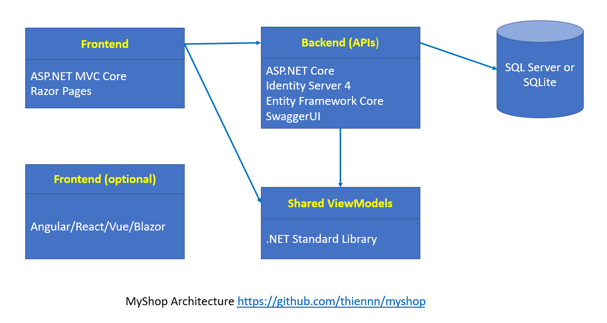
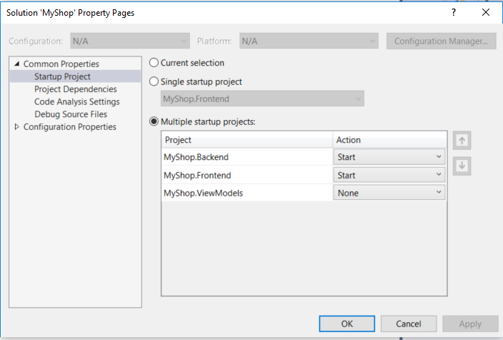

# MyShop, a sample project that can help you getting start with ASP.NET Core easier



# Getting started

You will need to have .NET Core 3.0 SDK installed. You can use Visual Studio 2019 or Visual Studio Code

## For Visual Studio

1. Open the MyShop.sln, build the solution. Set the MyShop.Backend as the Startup project.

2. Right click the MyShop.Backend, Choose "Manage User Secrets"
. In secrets.json add your connection string, this setting will override the ConnectionString in the appsettings.json

```json
  "ConnectionStrings": {
    "DefaultConnection": "Server=.;Database=MyShop;Trusted_Connection=True;MultipleActiveResultSets=true"
  }
```

3. Open the Package Manager Console, In the Package Manager Console windows make sure the MyShop.Backend is selected for Default project. Type `Update-Database` and press Enter

4. Right click on the solution, choose properties. In the Startup Project choose Multiple startup projects: MyShop.Backend and MyShop.Frontend



5. Click F5 to start

## For Visual Studio Code

1. At the root folder type `dotnet build` to build the MyShop.sln solution

2. Install Entity Framework Core Tools by run the command below

`dotnet tool install --global dotnet-ef --version 3.0.0`

3. Go to the src\MyShop.Backend open the appsettings.json update the connection string, then type `dotnet ef database update` to run migration. Then type `dotnet run` to launch the backend

4. Go to the src\MyShop.Frontend folder and type `dotnet run` to launch the frontend.